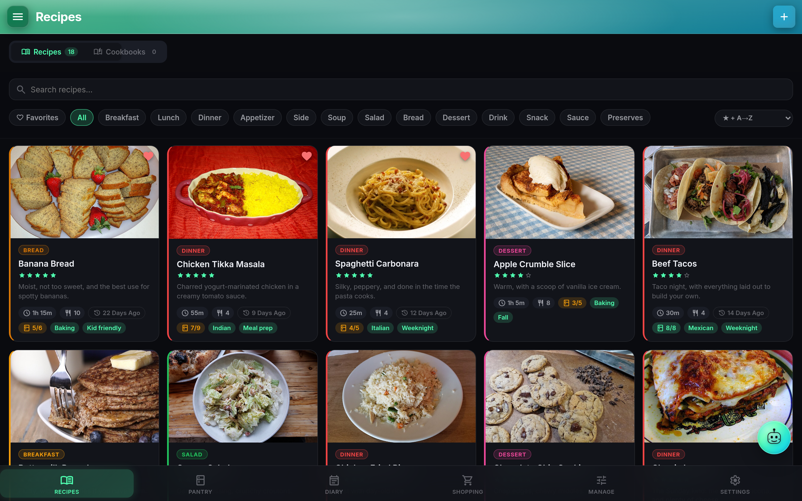

<h1 align="center">CookTrace</h1>

<p align="center"><b>Trace Every Recipe, From Pantry to Plate</b></p>

<p align="center">A self-hosted recipe, pantry, and cooking tracker.<br/>
No accounts, no telemetry, no cloud sync unless you opt in.</p>

<p align="center">
  
</p>

<p align="center">
  <a href="LICENSE"></a>
  <a href="https://github.com/traceapps/cooktrace/releases/latest"></a>
  <a href="https://github.com/traceapps/cooktrace/releases"></a>
  <a href="https://traceapps.github.io/docs/cooktrace/"></a>
  <a href="https://github.com/traceapps/cooktrace/pkgs/container/cooktrace"></a>
  <a href="https://github.com/traceapps/cooktrace/stargazers"></a>
</p>

---

**Jump to:** [What it is](#what-cooktrace-is) · [Features](#features) · [Install](#install) · [Env vars](#env-vars) · [Docs](https://traceapps.github.io/docs/cooktrace/)

---

## What CookTrace is

CookTrace runs as a single Docker container on your own hardware, with a PWA for the browser and a native Android app for your phone. No accounts on external services, no data leaving your network, no subscriptions.

Third app in the Trace family alongside [NutriTrace](https://github.com/traceapps/nutritrace) and [LiftTrace](https://github.com/traceapps/lifttrace).

## Principles

- **Self-hosting is and will remain free.** The server, PWA, and source code will never be paywalled.
- **No trackers, no analytics, no telemetry.** CookTrace doesn't phone home; your usage is invisible to anyone but you.
- **Your data stays on your hardware.** No central server, no cloud sync that can read it; nothing leaves your network unless you opt into a third-party integration (Open Food Facts, USDA, an AI provider).
- **Open source under AGPL-3.0.** Every line that touches your data is readable.

---



---

## Features

### Cooking
- **Recipe library.** Full recipe model, cook mode, cook log, live scaling with fraction-aware ingredient math, per-step photos, inline unit converter, FDA-style 34-nutriment Nutrition Facts box. → [full guide](https://traceapps.github.io/docs/cooktrace/recipes/)
- **Pantry.** Variants, expiration digests, barcode scanning (ML Kit native, QuaggaJS web), OFF + USDA quality signals, pantry-match pill on every recipe card. → [full guide](https://traceapps.github.io/docs/cooktrace/pantry/)
- **Cook Diary + Meal Planner.** List and month-calendar views, plan-then-cook flow, drag to re-plan. → [full guide](https://traceapps.github.io/docs/cooktrace/diary/)
- **Shopping list.** Generate from a recipe (skips stocked items), aisle grouping, cross-recipe dedup. → [full guide](https://traceapps.github.io/docs/cooktrace/shopping/)

### Organizing
- **Cookbooks + Kitchens.** Named collections, per-user and public-link shares, Kitchens for household-wide fanout with Auto-Share. → [Cookbooks](https://traceapps.github.io/docs/cooktrace/cookbooks/) · [Kitchens](https://traceapps.github.io/docs/cooktrace/kitchens/)
- **Recipe import.** URL (Standard / Enhanced / Smart tiers), file, photo, and bulk Mealie / Paprika / Tandoor zip archives. → [full guide](https://traceapps.github.io/docs/cooktrace/import/)
- **Manage catalog.** Categories (with color dots), tags, kitchen gear, pantry categories, units, cookbooks; drag-to-reorder with per-row recipe counts.

### AI + Federation
- **Trace AI.** Reads your recipes, pantry, diary, and cookbooks; can log a cook, plan a meal, add to shopping, or import a recipe from a URL, all conversationally. 19 tools total. Multi-provider (Claude / OpenAI / Gemini / any OpenAI-compatible endpoint). Smart Log voice, image attach, cook-mode voice control. → [full guide](https://traceapps.github.io/docs/cooktrace/trace/)
- **NutriTrace federation.** Pull food data per-user with a Bearer token; log cooks back to the NT diary. → [full guide](https://traceapps.github.io/docs/cooktrace/nt-federation/)

### Accounts + platforms
- **Multi-user + OIDC SSO.** Authentik, Keycloak, Pocket ID, Authelia, Auth0, Google. Auto-link verified emails, optional auto-register, admin-group claims, RP-initiated logout. → [full guide](https://traceapps.github.io/docs/auth/oidc/)
- **Backups.** Full-DB zip with zip-slip / zip-bomb defenses, scheduled auto-backups, portable JSON export, Android local-backup zip. → [full guide](https://traceapps.github.io/docs/self-hosting/backups/)
- **Native Android app.** Offline local mode or server-connected differential sync. → [full guide](https://traceapps.github.io/docs/mobile/install/)

---

## Apps

- **Web (PWA).** Any modern browser. Add to home screen for a full-screen app-like experience.
- **Android.** Signed APK on the [Releases page](https://github.com/traceapps/cooktrace/releases/latest). Local mode is fully offline; connected mode syncs to your server. → [install guide](https://traceapps.github.io/docs/mobile/install/)
- **iOS.** Not currently available.

---

## Install

Minimal `docker-compose.yml`:

```yaml
services:
  cooktrace:
    image: ghcr.io/traceapps/cooktrace:latest
    container_name: cooktrace
    ports:
      - "3000:3001"
    volumes:
      - ./data/db:/data/db
      - ./data/uploads:/data/uploads
    environment:
      - JWT_SECRET=change-me-to-a-long-random-string
      - DB_PATH=/data/db/cooktrace.db
      - UPLOADS_PATH=/data/uploads
      # OIDC (optional): uncomment and fill in for SSO
      # - OIDC_ISSUER=https://auth.example.com
      # - OIDC_CLIENT_ID=cooktrace
      # - OIDC_CLIENT_SECRET=...
    restart: unless-stopped
```

Generate the JWT secret with `openssl rand -base64 48`, then:

```bash
docker compose up -d
```

Open `http://localhost:3000` and a first-run wizard walks you through enabling user management and creating an admin account.

Full walkthrough (env-file layout, reverse proxy, LAN-HTTP notes) at [docs/getting-started/compose](https://traceapps.github.io/docs/getting-started/compose/). See [DEPLOY.md](DEPLOY.md) for image tag conventions and `dev-latest` publishing.

---

## Env vars

The most-asked knobs. Full list at [docs/self-hosting/env-vars](https://traceapps.github.io/docs/self-hosting/env-vars/).

| Variable | Default | Purpose |
|---|---|---|
| `JWT_SECRET` | - | Signing key for auth tokens. Required when user management is on. |
| `DB_PATH` | `/data/db/cooktrace.db` | SQLite file inside the container. |
| `UPLOADS_PATH` | `/data/uploads` | Uploaded images and server-side backups. |
| `PORT` | `3001` | Port the server listens on inside the container. |
| `BASE_URL` | - | Mount at a subpath, e.g. `/cooktrace`. |
| `LOG_LEVEL` | `info` | `error` \| `warn` \| `info` \| `debug`. |
| `INSECURE_COOKIES` | unset | Set to `1` on plain-HTTP LAN deployments so the auth cookie isn't dropped. See [LAN-HTTP notes](https://traceapps.github.io/docs/getting-started/lan-http/). |
| `MAX_SESSION_HOURS` | `8760` | Session-length cap in hours. Lower for shared / kiosk machines. |
| `IMPORT_ZIP_MAX_MB` | `512` | Upload cap for Mealie / Tandoor / Paprika bulk-import zips. |
| `BACKUP_UPLOAD_MAX_MB` | `512` | Upload cap for restore-from-zip. |
| `BACKUP_SCHEDULE` | - | `off` \| `daily` \| `weekly` \| `monthly`. Locks the UI field when set. |
| `BACKUP_TIME` | - | Auto-backup time (HH:MM, container TZ). Locks the UI field. |
| `BACKUP_RETENTION` | - | How many auto-backups to keep. |
| `SMTP_HOST` / `SMTP_PORT` / `SMTP_USER` / `SMTP_PASS` / `SMTP_FROM` / `SMTP_SECURE` | - | Password reset + invite email. Without SMTP, invites fall back to a copyable link. |
| `AI_PROVIDER` / `AI_API_KEY` / `AI_MODEL` / `AI_BASE_URL` / `AI_ENABLED` | - | Lock Trace to a server-side provider. Required combo for local endpoints is `AI_PROVIDER=oai-compat` + `AI_BASE_URL` + `AI_MODEL`. |
| `OIDC_ISSUER` / `OIDC_CLIENT_ID` / `OIDC_CLIENT_SECRET` (or numbered `OIDC_PROVIDER_N_*`) | - | OIDC SSO provider(s). Env-defined providers are read-only in the UI. Full setup at [docs/auth/oidc](https://traceapps.github.io/docs/auth/oidc/). |

Env values take priority over Settings-UI values and lock the field for all users.

---

## Data persistence

Bind-mount two host directories: the SQLite database (`DB_PATH` dir) and uploads (`UPLOADS_PATH`, which also holds `uploads/backups/`). The container is stateless beyond these two volumes.

## Updating

```bash
docker compose pull
docker compose up -d
```

Schema migrates on startup. Images are multi-arch (linux/amd64 + linux/arm64), so the same command works on x86 hosts, Raspberry Pi 4 / 5, Apple Silicon servers, and ARM cloud instances.

---

## Tech stack

Svelte 5 (compat mode) + Vite 7 PWA · Capacitor 8 Android · Node.js + Express 5 + better-sqlite3 · `recipe-scrapers` Python bridge (baked into the image) · JWT httpOnly cookies + OIDC 1.0 (PKCE + state + nonce) · multi-arch Docker via GitHub Actions → GHCR.

---

## Trace family

Part of the **TraceApps** family. Sister apps: [NutriTrace](https://github.com/traceapps/nutritrace) for nutrition tracking, [LiftTrace](https://github.com/traceapps/lifttrace) for weightlifting. Full docs for all three at [traceapps.github.io/docs](https://traceapps.github.io/docs/).

---

## More

[ROADMAP.md](ROADMAP.md) · [CHANGELOG.md](CHANGELOG.md) · [CONTRIBUTING.md](CONTRIBUTING.md) · [PRIVACY.md](PRIVACY.md) · [Full documentation](https://traceapps.github.io/docs/cooktrace/)

## Support

CookTrace is free to self-host and always will be. It's built and maintained by one person; donations help cover real costs (Apple Developer account for an eventual iOS port, hosting, hardware). Starring the repo helps with discoverability and costs nothing.

[](https://ko-fi.com/traceapps)

## Disclaimer

CookTrace is not medical, health, or nutrition-professional software. Recipe entries, pantry tracking, AI-extracted nutrition, Trace AI suggestions, Smart Log parsing, and any analytical output are for informational and self-tracking purposes only. Consult a qualified healthcare professional, registered dietitian, or licensed nutritionist before starting a new eating plan or making significant dietary changes, especially with medical conditions in play (diabetes, eating disorders, food allergies, pregnancy, breastfeeding, pediatric needs, kidney or liver disease, metabolic disorders). Trace AI answers can be incorrect; third-party nutrition data (Open Food Facts, recipe websites, schema.org markup, AI photo extraction) is community-curated and may contain inaccuracies. **Use at your own risk.**

## License

[AGPL-3.0](LICENSE): entire codebase including the Android app source.
